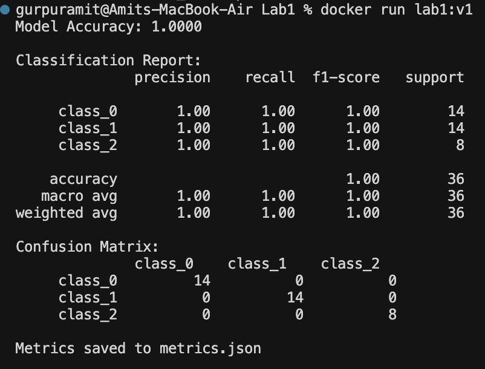
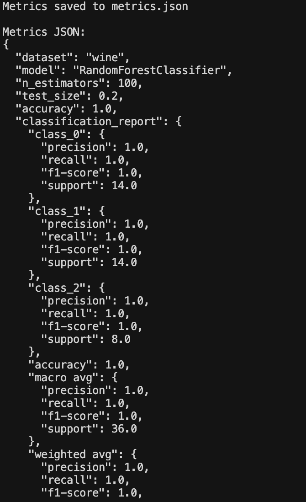
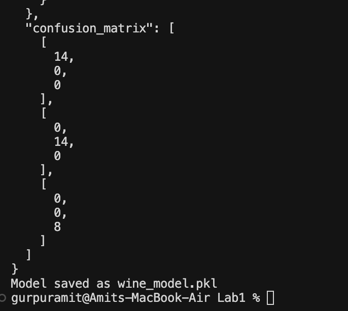

# Docker Lab1 — Report of Modifications
# Amit Karanth Gurpur

This lab trains a Random Forest classifier inside a Docker container. The following changes were made to the original lab.

**Changes made**

1. The Iris dataset was replaced with the Wine dataset. The model now trains on Wine’s 13 features and 3 classes.
2. Model evaluation was added: the script prints accuracy and a classification report (precision, recall, F1) on the test set.
3. A confusion matrix is computed and printed so you can see how the model performs per class.
4. All evaluation metrics (accuracy, classification report, confusion matrix) are written to `metrics.json` inside the container and also printed to the terminal as formatted JSON.

**How to run**

From the Lab1 directory:

```
docker build -t lab1:v1 .
docker run lab1:v1
```

To save the image to a tar file:

```
docker save lab1:v1 > my_image.tar
```

When you run the container, it will print the accuracy, classification report, confusion matrix, and the metrics JSON, then confirm that the model was saved as `wine_model.pkl` and that metrics were saved to `metrics.json`.

**Sample output**






