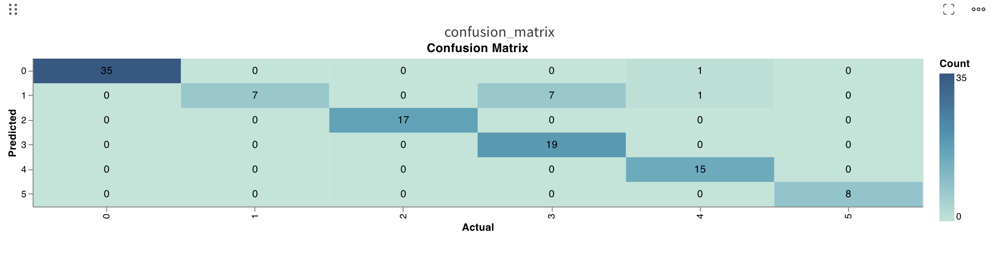
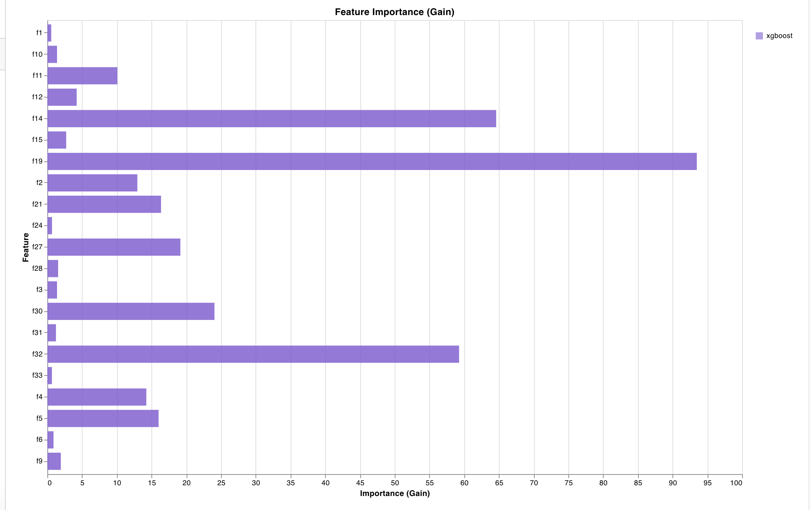
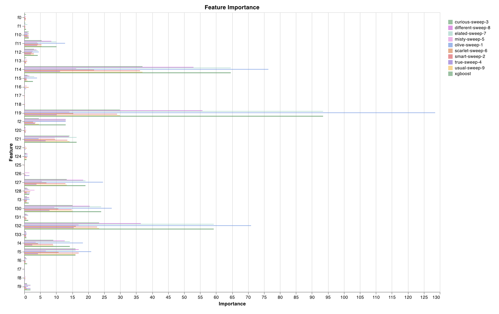
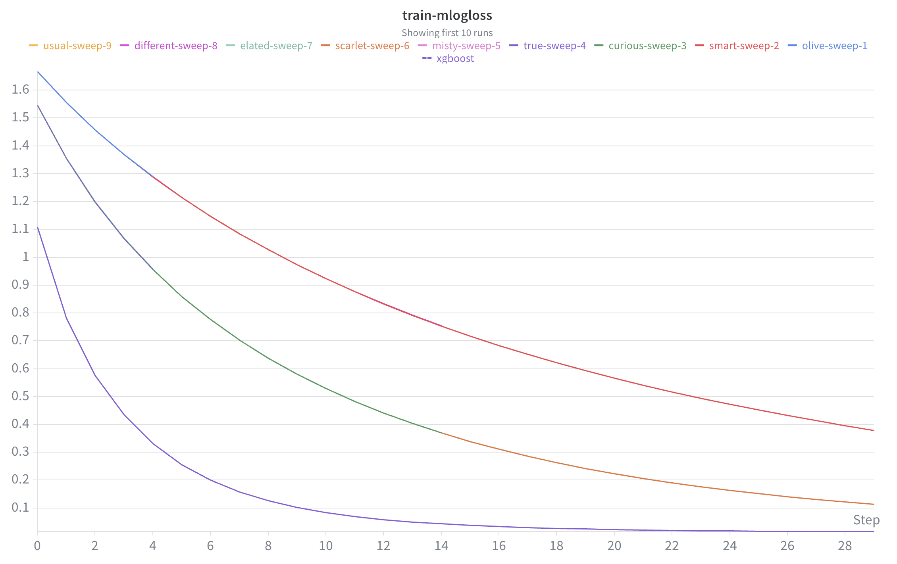
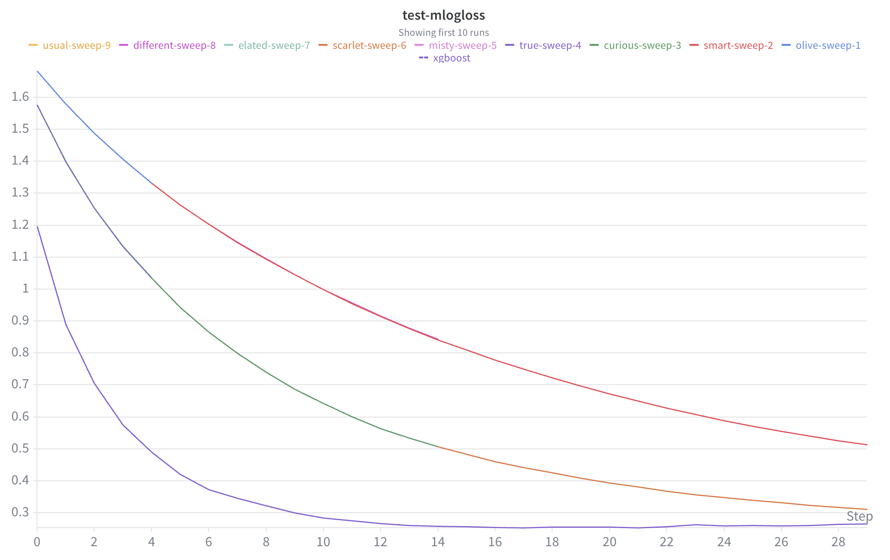
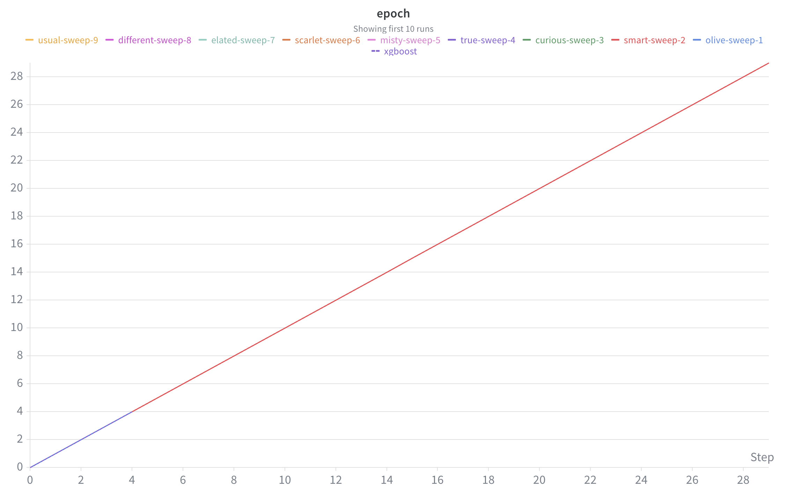

# Lab 1 - XGBoost with W&B Experiment Tracking

# Amit Karanth Gurpur
# NUID: 002326789
# Lab Assignment 6 Submission, Due 11th April, 2026

Trains an XGBoost classifier on the UCI Dermatology dataset (6-class) and tracks experiments using Weights & Biases.

## What's logged to W&B
- Training/validation error per round
- Feature importance bar chart
- Per-class precision, recall, and F1-score
- Confusion matrix
- Hyperparameter sweep (9 trials across learning rate, tree depth, and rounds)

## Setup

```bash
python3 -m venv .venv
source .venv/bin/activate
pip install wandb xgboost scikit-learn numpy pandas jupyter
```

## Running

```bash
wandb login
jupyter notebook Lab1.ipynb
```

Run all cells top to bottom. The last cell launches the hyperparameter sweep — it will take a few minutes to complete all 9 trials.

## Screenshots

### Confusion Matrix

The model classifies most of the 6 dermatology classes correctly, with the strongest performance on psoriasis (class 0). The only notable confusion is between classes 1 and 3.

### Feature Importance (Gain)

Shows how much each feature contributed to the model's splits by gain. Feature f18 is by far the most important, followed by f32 and f14.

### Feature Importance (Sweep Overlay)

Same importance chart overlaid across all 9 sweep runs. The ranking stays consistent regardless of hyperparameter choice, which confirms the feature signal is stable.

### Training Loss

Training loss curves for all 9 sweep runs. Runs with higher learning rate and more rounds converge faster and lower, clearly visible as the spread between curves.

### Test Loss

Test loss across sweep runs mirrors the training curves. The best-performing runs bottom out near 0, while slower configs (low eta, few rounds) plateau higher.

### Epoch Tracking

Tracks the number of boosting rounds per run. The sweep varied this between 5, 15, and 30 — visible as the different line lengths across runs.
